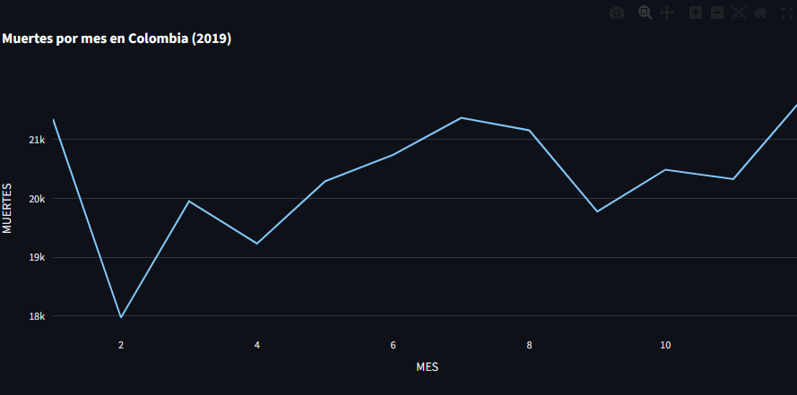
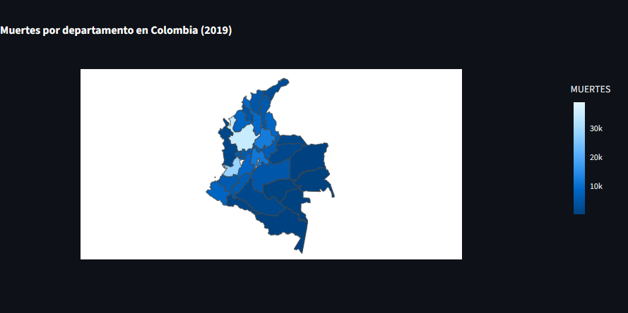
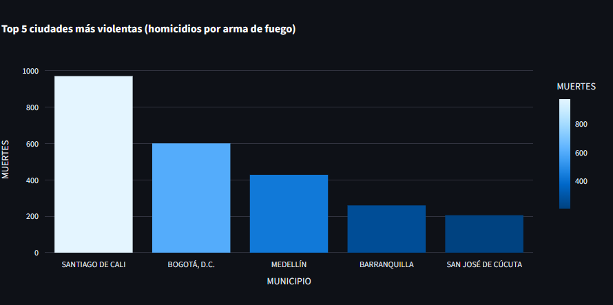
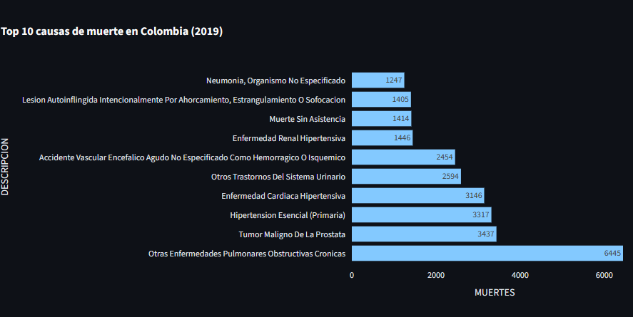
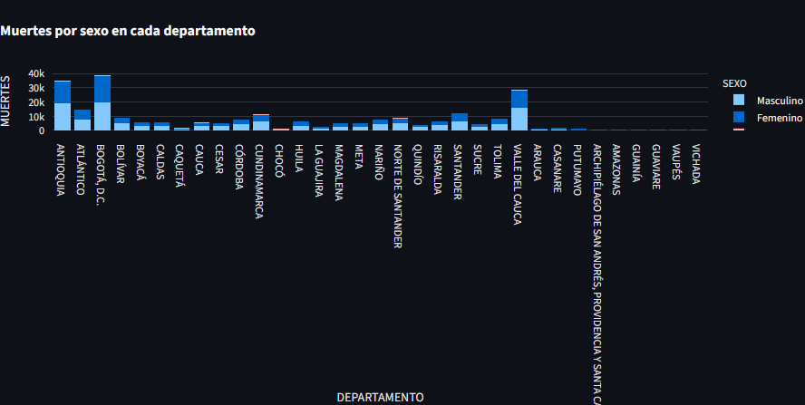
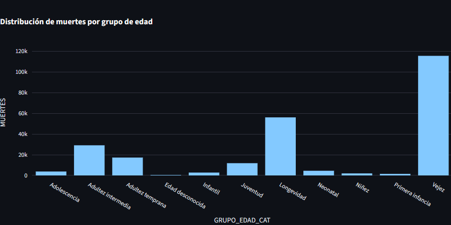
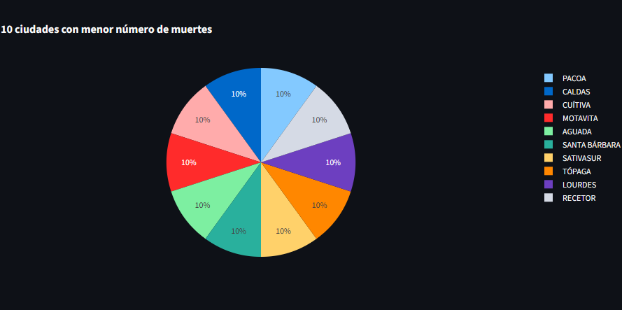

# Análisis de la Mortalidad en Colombia (2019)

## Introducción
Este proyecto consiste en una aplicación web interactiva diseñada para la exploración, visualización y análisis crítico de los registros de casos de mortalidad en Colombia durante el año 2019. Utilizando los microdatos oficiales provistos por el DANE (Departamento Administrativo Nacional de Estadística), la plataforma consolida los casos asociados a causas naturales, accidentes laborales, siniestros viales y homicidios. 

A través del uso de herramientas computacionales avanzadas, la aplicación transforma bases de datos complejas en gráficos dinámicos e indicadores estadísticos estructurados, facilitando la interpretación de fenómenos demográficos y de salud pública en el país.

---

## Objetivo
Desarrollar una aplicación web interactiva mediante el framework Streamlit que permita centralizar, procesar y analizar los datos de mortalidad en Colombia para el año 2019, utilizando información oficial del DANE. El sistema tiene como fin identificar patrones temporales, tendencias demográficas y factores de riesgo críticos (como la distribución geográfica, las principales patologías, las brechas de género y el impacto por ciclos de vida) mediante herramientas de análisis de datos y visualizaciones dinámicas orientadas al análisis de resultados.

---

## Estructura del Proyecto
El repositorio está organizado de forma modular y por bloques para garantizar la separación de responsabilidades, facilitando el mantenimiento del código, futuros cambios y la carga eficiente de datos:

* **`streamlit_app.py`**: Archivo principal y punto de entrada de la aplicación. Controla la interfaz en Streamlit, gestiona la ejecución del entorno y orquesta de forma centralizada la integración de los diferentes módulos del sistema.
* **`módulos/`**: Carpeta encargada de la lógica de procesamiento interno:
  * **`cargar.py`**: Script dedicado exclusivamente a la lectura física de los archivos fuente de datos, transformándolos en DataFrames optimizados en memoria para su manipulación.
* **`vistas/`**: Carpeta modular que contiene la configuración de la interfaz y las funciones individuales encargadas de construir los componentes visuales:
  * **`Paginaweb.py`**: Archivo dedicado a la configuración estructural de la aplicación web. Se encarga de gestionar la barra de navegación, menús laterales o disposición general de las secciones, importando y renderizando todos los gráficos en la web.
  * **`Graficolineas.py`**: Renderiza la tendencia y variaciones temporales de las muertes a lo largo de los meses del año mediante Plotly.
  * **`Mapa.py`**: Diseña un mapa coroplético para la visualización cartográfica de la densidad de mortalidad por departamento.
  * **`Causasmuertes.py`**: Genera una tabla estructurada con el ranking (Top 10) de las principales causas de fallecimiento.
  * **`Graficobaapiladas.py`**: Gráfico de barras apiladas enfocado en la comparativa de mortalidad por sexo dentro de cada territorio.
  * **`Graficobarras.py`**: Análisis enfocado en los 5 centros urbanos con mayor índice de homicidios bajo criterios CIE-10 (como armas de fuego).
  * **`Edades.py`**: Histograma de distribución de frecuencias según las etapas del ciclo vital humano.
  * **`Graficocircular.py`**: Gráfico de sectores que resalta los 10 municipios con menor volumen de mortalidad.
* **`datos/`**: Carpeta que almacena las bases de datos originales en formato Excel provistas por el DANE:
  * **`NoFetal2019.xlsx`**: Base de datos principal con los registros individuales de defunciones no fetales.
  * **`Divipola.xlsx`**: Archivo de la División Político-Administrativa para traducir códigos numéricos territoriales a nombres reales de municipios y departamentos.
  * **`Codigos DeMuerte.xlsx`**: Diccionario oficial de traducción para los códigos de diagnóstico médico (CIE-10).
* **`Mapgeoj/`**: Carpeta técnica para archivos geográficos:
  * **`mapacol.geojson`**: Archivo de polígonos que contiene las coordenadas geográficas de los departamentos de Colombia para delimitar correctamente el mapa coroplético.
* **`requirements.txt`**: Archivo de texto que detalla las librerías externas de Python y las versiones necesarias para el entorno de ejecución.

---

## Requisitos
Para clonar, ejecutar y verificar la aplicación de manera local, es necesario configurar un entorno de Python e instalar las dependencias externas que se encuentran detalladas en el archivo `requirements.txt`:

* **`streamlit`**: Framework ágil utilizado para la estructuración y renderizado de la interfaz web de usuario.
* **`pandas`**: Biblioteca especializada en la indexación, limpieza y manejo de estructuras de datos (*DataFrames*).
* **`plotly`**: Motor gráfico interactivo para el diseño de mapas coropléticos y analítica visual.
* **`openpyxl`**: Módulo encargado de realizar la lectura y decodificación de los archivos físicos en formato Excel.

Para realizar la instalación automatizada de todas las librerías requeridas, ejecute el siguiente comando en la terminal de su sistema:

```bash
pip install -r requirements.txt

```
---
## Despliegue en Azure App Service
El despliegue en la nube se realizó utilizando la plataforma como servicio (PaaS) **Azure App Service**, lo cual permite que la aplicación esté disponible públicamente a través de Internet mediante una URL funcional de manera continua.
# Actualización Azure
git add .
git commit -m "Trigger Azure deploy"
git push

### Proceso de configuración e infraestructura
* **Creación del Recurso**: En el portal de Azure, se configuró un nuevo *App Service* bajo una plataforma Linux y se seleccionó el entorno de ejecución nativo para **Python (versión 3.10 o superior)**.
* **Centro de Despliegue (CI/CD)**: Se vinculó de manera directa el servicio de Azure con el repositorio del proyecto hospedado en **GitHub**, autorizando la rama principal (`main`). Mediante *GitHub Actions*, cada vez que el repositorio recibe una actualización, Azure descarga el código automáticamente.
* **Construcción del Entorno**: El motor de Azure (Oryx) detecta el archivo `requirements.txt` en la raíz e instala en el contenedor todas las librerías necesarias (`streamlit`, `pandas`, `plotly` y `openpyxl`).
* **Comando de Inicio (*Startup Command*)**: Las aplicaciones basadas en Streamlit no corren sobre servidores web tradicionales. Streamlit levanta su propio servidor interno y requiere exponer un puerto específico. Para solucionar esto, en la sección de *Configuración General* en Azure se estableció la siguiente instrucción personalizada de arranque:

```bash
streamlit run streamlit_app.py --server.port 8000 --server.address 0.0.0.0

```
---
## Visualizaciones e interpretación de resultados

La aplicación web incorpora múltiples visualizaciones interactivas diseñadas para facilitar el análisis de la mortalidad desde diferentes perspectivas estadísticas, territoriales y demográficas. Cada gráfico transforma grandes volúmenes de datos en representaciones visuales comprensibles, permitiendo identificar tendencias, concentraciones y patrones relevantes dentro del comportamiento de las defunciones.


### Total de muertes por mes

El gráfico de líneas representa la variación mensual del total de muertes registradas, permitiendo analizar la evolución temporal de la mortalidad y reconocer cambios significativos a lo largo del año. En la visualización se observa una disminución importante al inicio del periodo, seguida de una recuperación progresiva en los meses posteriores. Hacia la mitad del año se evidencia un incremento sostenido que supera los 21 mil casos, mientras que en los últimos meses vuelve a presentarse un ascenso considerable, alcanzando el punto más alto del gráfico.

Desde una perspectiva analítica, este comportamiento demuestra que la mortalidad no mantiene una distribución uniforme durante el año, sino que presenta fluctuaciones temporales asociadas posiblemente a factores epidemiológicos, condiciones climáticas o variaciones sociales. El principal hallazgo de esta representación es la existencia de meses con una carga de mortalidad considerablemente mayor, lo que permite identificar periodos críticos dentro del análisis general.

<p align="center">
  
</p>


### Total de muertes por departamento

El mapa coroplético permite visualizar la distribución territorial de las muertes por departamento en Colombia. La escala de colores utilizada facilita la interpretación geográfica de los datos, donde los departamentos en color blanco representan la mayor intensidad de mortalidad y los tonos azul oscuro corresponden a menores concentraciones de muertes.

La representación espacial evidencia que la mortalidad no se distribuye de manera homogénea en el territorio nacional. Los departamentos con mayor intensidad coinciden principalmente con regiones altamente pobladas y con importantes centros urbanos, mientras que otros territorios presentan valores considerablemente menores.

El hallazgo principal del mapa es la fuerte concentración territorial de las defunciones en determinados departamentos, lo cual evidencia desigualdades regionales relacionadas con densidad poblacional, urbanización y acceso a servicios de salud.

<p align="center">
  
</p>


### Ciudades más violentas

El gráfico de barras presenta las cinco ciudades con mayor número de homicidios asociados a agresiones mediante arma de fuego, permitiendo identificar los territorios urbanos con mayores problemáticas de violencia letal.

Dentro de los resultados, Santiago de Cali aparece como la ciudad con el mayor número de homicidios, alcanzando aproximadamente 970 casos, seguida por Bogotá D.C., Medellín, Barranquilla y San José de Cúcuta. La diferencia entre Cali y las demás ciudades resulta significativamente amplia, lo que evidencia una fuerte concentración de violencia homicida en este territorio.

La visualización permite concluir que la violencia no afecta de manera uniforme a las ciudades del país, sino que se concentra principalmente en determinados centros urbanos donde convergen problemáticas relacionadas con criminalidad, inseguridad y conflictividad social.

<p align="center">
  
</p>


### Principales causas de muerte

La tabla de causas de muerte reúne las diez principales causas de defunción y permite identificar cuáles enfermedades o condiciones presentan mayor impacto dentro de la mortalidad general.

Uno de los hallazgos más relevantes es el predominio de enfermedades crónicas y cardiovasculares, ya que varias de las principales causas están relacionadas con afecciones respiratorias, hipertensión y enfermedades cardíacas o renales. Esto demuestra que una parte significativa de las defunciones se encuentra asociada a enfermedades no transmisibles y de larga duración.

Asimismo, la diferencia entre la primera causa y las demás refleja una concentración importante de muertes relacionadas con enfermedades pulmonares obstructivas crónicas, evidenciando el impacto de problemas respiratorios dentro de la salud pública.

<p align="center">
  
</p>


### Sexo por departamento

El gráfico de barras apiladas compara el total de muertes entre hombres y mujeres en cada departamento, permitiendo analizar diferencias de mortalidad según el sexo y la región.

En la mayoría de los departamentos se observa una mayor cantidad de muertes masculinas frente a las femeninas, aunque la magnitud de esta diferencia varía dependiendo del territorio analizado. Los departamentos con mayor volumen de defunciones corresponden principalmente a Antioquia, Bogotá D.C. y Valle del Cauca, mientras que regiones como Vaupés, Vichada, Guainía y Amazonas presentan niveles considerablemente menores.

El principal hallazgo de esta representación es la existencia de una sobremortalidad masculina generalizada, acompañada de importantes diferencias territoriales.

<p align="center">
  
</p>


### Distribución por grupo de edad

El histograma de distribución por grupo de edad muestra cómo se concentran las muertes en las diferentes etapas del ciclo de vida, permitiendo identificar cuáles grupos etarios presentan mayor vulnerabilidad.

La visualización evidencia una concentración extremadamente alta de muertes en el grupo de vejez, superando ampliamente los demás rangos de edad. Posteriormente aparecen longevidad y adultez intermedia, mientras que las categorías asociadas a infancia y juventud presentan cantidades considerablemente menores.

El principal hallazgo del gráfico es la fuerte relación entre envejecimiento y mortalidad, demostrando que las defunciones aumentan de manera significativa conforme avanza la edad.

<p align="center">
  
</p>


### Ciudades con menor mortalidad

El gráfico circular representa las ciudades con menor índice de mortalidad, permitiendo comparar visualmente la participación relativa de cada una dentro del conjunto analizado.

Las proporciones observadas son relativamente similares entre las ciudades seleccionadas, lo que indica una distribución equilibrada dentro del grupo con menor cantidad de defunciones. Este comportamiento sugiere que dichos territorios presentan una participación reducida dentro del total nacional de muertes.

El principal hallazgo del gráfico es que las ciudades con menor mortalidad mantienen niveles bastante homogéneos entre sí, posiblemente asociados a menor densidad poblacional y características demográficas particulares.

<p align="center">
  
</p>

---